# 📺 Relatório Completo: Sistema de EPG (Electronic Program Guide)

Este documento detalha toda a lógica de obtenção do EPG utilizada no projeto Free TV, para replicação em outros aplicativos.

---

## 📋 Índice

1. [Visão Geral](#visão-geral)
2. [Arquitetura do Sistema](#arquitetura-do-sistema)
3. [Estruturas de Dados](#estruturas-de-dados)
4. [Fontes de Dados](#fontes-de-dados)
5. [Sistema de Proxies CORS](#sistema-de-proxies-cors)
6. [Sistema de Cache](#sistema-de-cache)
7. [Mapeamento de Canais](#mapeamento-de-canais)
8. [Processo de Busca de Dados](#processo-de-busca-de-dados)
9. [Parsing do HTML](#parsing-do-html)
10. [Funções Públicas da API](#funções-públicas-da-api)
11. [Código Pronto para Replicação](#código-pronto-para-replicação)

---

## Visão Geral

O sistema EPG obtém dados de programação de TV via **web scraping** de duas fontes principais:
- **meuguia.tv** - Fonte principal para a maioria dos canais
- **guiadetv.com** - Fonte alternativa para canais específicos (HBO Pop, CNN Brasil, etc.)

### Características do Sistema
| Característica | Descrição |
|----------------|-----------|
| **Método** | Web scraping de HTML |
| **Cache** | Persistente (localStorage) + memória |
| **Duração do Cache** | 30 dias (mensal) |
| **Atualização** | Automática quando programação está acabando |
| **Retry** | Backoff exponencial com múltiplos proxies |
| **Carregamento** | Em background, em lotes de 2 canais |

---

## Arquitetura do Sistema

```mermaid
flowchart TB
    subgraph Fontes["🌐 Fontes de Dados"]
        MG["meuguia.tv"]
        GDT["guiadetv.com"]
    end
    
    subgraph Proxies["🔄 Proxies CORS"]
        P1["AllOrigins"]
        P2["CorsProxy.io"]
        P3["CodeTabs"]
        P4["Cors.sh"]
        P5["ThingProxy"]
    end
    
    subgraph Service["⚙️ EPG Service"]
        FETCH["fetchChannelEPGAsync()"]
        PARSE["parseHTMLPrograms()"]
        CACHE["Cache (Map + localStorage)"]
        NOTIFY["notifyListeners()"]
    end
    
    subgraph App["📱 Aplicação"]
        COMP["Componentes React"]
        UI["Interface do Usuário"]
    end
    
    MG --> P1 --> FETCH
    GDT --> P2 --> FETCH
    FETCH --> PARSE --> CACHE --> NOTIFY --> COMP --> UI
```



---

## Estruturas de Dados

### Interface `Program` (Programa de TV)

```typescript
interface Program {
  id: string;              // ID único (formato: "channelId-timestamp")
  title: string;           // Nome do programa
  description?: string;    // Descrição/sinopse
  startTime: Date;         // Horário de início
  endTime: Date;           // Horário de término
  category?: string;       // Gênero (ex: "Jornalístico", "Filme")
  rating?: string;         // Classificação indicativa
  thumbnail?: string;      // Imagem do programa
  isLive?: boolean;        // Se é transmissão ao vivo
  episodeInfo?: {          // Info de episódio (se série)
    season?: number;
    episode?: number;
    episodeTitle?: string;
  };
}
```

### Interface `ChannelEPG` (EPG de um Canal)

```typescript
interface ChannelEPG {
  channelId: string;       // ID do canal
  programs: Program[];     // Lista de programas
}
```

### Interface `CurrentProgram` (Programa Atual)

```typescript
interface CurrentProgram {
  current: Program | null;  // Programa em exibição agora
  next: Program | null;     // Próximo programa
  progress: number;         // Progresso (0-100%)
}
```

---

## Fontes de Dados

### 1. meuguia.tv (Fonte Principal)

- **URL Base**: `https://meuguia.tv/programacao/canal/{CODIGO}`
- **Exemplo**: `https://meuguia.tv/programacao/canal/HBO`
- **Formato**: HTML com estrutura específica
- **Cobertura**: 70+ canais brasileiros

### 2. guiadetv.com (Fonte Alternativa)

- **URL Base**: `https://www.guiadetv.com/canal/{SLUG}`
- **Exemplo**: `https://www.guiadetv.com/canal/hbo-pop`
- **Formato**: HTML com atributos `data-dt`
- **Uso**: Canais que não funcionam no meuguia.tv

---

## Sistema de Proxies CORS

Como os navegadores bloqueiam requisições cross-origin, o sistema usa múltiplos proxies com fallback automático:

```typescript
const CORS_PROXIES = [
  // Proxy 1: AllOrigins - Mais estável, mas tem rate limit
  (url: string) => `https://api.allorigins.win/raw?url=${encodeURIComponent(url)}`,

  // Proxy 2: CorsProxy.io - Bom fallback, rápido
  (url: string) => `https://corsproxy.io/?${encodeURIComponent(url)}`,

  // Proxy 3: CodeTabs - Alternativa confiável
  (url: string) => `https://api.codetabs.com/v1/proxy?quest=${encodeURIComponent(url)}`,

  // Proxy 4: Cors.sh - Requer header especial às vezes
  (url: string) => `https://proxy.cors.sh/${url}`,

  // Proxy 5: ThingProxy - Último recurso
  (url: string) => `https://thingproxy.freeboard.io/fetch/${url}`,
];
```

### Estratégia de Fallback

1. Começa pelo último proxy que funcionou
2. Se falhar, tenta o próximo proxy
3. Se todos falharem, aguarda e tenta novamente (até 3 vezes)
4. Delay aumenta exponencialmente entre retries (1s, 2s, 4s)

---

## Sistema de Cache

### Cache em Memória

```typescript
const epgCache: Map<string, Program[]> = new Map();
const lastFetch: Map<string, number> = new Map();
const pendingFetches: Map<string, Promise<Program[]>> = new Map();
```

### Cache Persistente (localStorage)

```typescript
const CACHE_KEY = 'epg_cache_v2';
const CACHE_META_KEY = 'epg_cache_meta_v2';
const ONE_MONTH_MS = 30 * 24 * 60 * 60 * 1000; // 30 dias

interface CacheMeta {
  lastFullLoad: number;
  channelLastUpdate: Record<string, number>;
}
```

### Quando Atualizar o Cache

O cache é atualizado quando:
1. **Não existe cache** para o canal
2. **Cache tem mais de 30 dias**
3. **Programação acabando** (menos de 5 programas futuros)

```typescript
function needsUpdate(channelId: string): boolean {
  const programs = epgCache.get(channelId);
  const fetchTime = lastFetch.get(channelId) || 0;
  const now = Date.now();

  // Sem cache
  if (!programs || programs.length === 0) return true;

  // Cache muito antigo (mais de 1 mês)
  if (now - fetchTime > ONE_MONTH_MS) return true;

  // Poucos programas futuros
  const nowDate = new Date();
  const futurePrograms = programs.filter(p => p.endTime > nowDate);
  if (futurePrograms.length < 5) return true;

  return false;
}
```

---

## Mapeamento de Canais

### Códigos do meuguia.tv

| ID Interno | Código | Canal |
|------------|--------|-------|
| **Telecine** | | |
| telecine-action | TC2 | Telecine Action |
| telecine-premium | TC1 | Telecine Premium |
| telecine-pipoca | TC4 | Telecine Pipoca |
| telecine-cult | TC5 | Telecine Cult |
| telecine-fun | TC6 | Telecine Fun |
| telecine-touch | TC3 | Telecine Touch |
| **HBO** | | |
| hbo | HBO | HBO |
| hbo2 | HB2 | HBO 2 |
| hbo-family | HFA | HBO Family |
| hbo-plus | HPL | HBO Plus |
| **Globo** | | |
| globo-sp | GRD | Globo SP |
| globo-news | GLN | Globo News |
| **SporTV** | | |
| sportv | SPO | SporTV |
| sportv2 | SP2 | SporTV 2 |
| sportv3 | SP3 | SporTV 3 |
| **ESPN** | | |
| espn | ESP | ESPN |
| espn2 | ES2 | ESPN 2 |
| espn3 | ES3 | ESPN 3 |
| **TV Aberta** | | |
| sbt | SBT | SBT |
| band | BAN | Band |
| record | REC | Record |
| rede-tv | RTV | RedeTV! |
| **Infantil** | | |
| cartoon-network | CAR | Cartoon Network |
| discovery-kids | DIK | Discovery Kids |
| gloob | GOB | Gloob |
| **Documentários** | | |
| discovery | DIS | Discovery |
| history | HIS | History |
| animal-planet | APL | Animal Planet |
| **Séries** | | |
| warner | WBT | Warner |
| tnt | TNT | TNT |
| axn | AXN | AXN |
| **Esportes** | | |
| premiere | 121 | Premiere |
| combate | 135 | Combate |

### Slugs do guiadetv.com

| ID Interno | Slug | Motivo |
|------------|------|--------|
| hbo-pop | hbo-pop | Não funciona no meuguia.tv |
| hbo-xtreme | hbo-xtreme | Não funciona no meuguia.tv |
| hbo-mundi | hbo-mundi | Não funciona no meuguia.tv |
| cnn-brasil | cnn-brasil | Não funciona no meuguia.tv |
| cartoonito | cartoonito | Não funciona no meuguia.tv |

---

## Processo de Busca de Dados

### Fluxo Principal

```mermaid
flowchart TD
    A[Requisição para Canal] --> B{Canal tem código?}
    B -- Não --> C[Return vazio]
    B -- Sim --> D{Cache válido?}
    D -- Sim --> E[Return do cache]
    D -- Não --> F{Fetch pendente?}
    F -- Sim --> G[Aguarda pendente]
    F -- Não --> H[Decide fonte]
    H --> I{Canal no guiadetv?}
    I -- Sim --> J[Busca guiadetv.com]
    I -- Não --> K[Busca meuguia.tv]
    J --> L[Parse HTML]
    K --> L
    L --> M[Salva cache]
    M --> N[Notifica listeners]
    N --> O[Return programas]
```



### Código de Fetch com Fallback

```typescript
async function fetchWithProxyFallback(
  url: string,
  channelId: string,
  source: 'meuguia' | 'guiadetv' = 'meuguia'
): Promise<string | null> {
  const MAX_RETRIES = 3;
  const INITIAL_RETRY_DELAY = 1000;
  
  for (let retry = 0; retry < MAX_RETRIES; retry++) {
    const retryDelay = INITIAL_RETRY_DELAY * Math.pow(2, retry);

    for (let i = 0; i < CORS_PROXIES.length; i++) {
      const proxyIndex = (currentProxyIndex + i) % CORS_PROXIES.length;
      const proxyUrl = CORS_PROXIES[proxyIndex](url);

      try {
        const response = await fetchWithTimeout(proxyUrl, 15000);

        if (response.ok) {
          const html = await response.text();
          
          // Validação específica por fonte
          let isValidHtml = false;
          if (source === 'guiadetv') {
            isValidHtml = html.length > 1000 && 
              (html.includes('data-dt=') || html.includes('/programa/'));
          } else {
            isValidHtml = html.length > 1000 && 
              (html.includes('lileft time') || html.includes('<h2>'));
          }

          if (isValidHtml) {
            currentProxyIndex = proxyIndex;
            return html;
          }
        }
      } catch (error) {
        continue; // Tenta próximo proxy
      }
    }

    // Aguarda antes do próximo retry
    if (retry < MAX_RETRIES - 1) {
      await new Promise(resolve => setTimeout(resolve, retryDelay));
    }
  }

  return null;
}
```

---

## Parsing do HTML

### Parser para meuguia.tv

O HTML do meuguia.tv tem esta estrutura:

```html
<!-- Cabeçalho de data -->
<li class="subheader">10/01 - Segunda-feira</li>

<!-- Programa -->
<div class='lileft time'>20:00</div>
<!-- ... outros elementos ... -->
<h2>Jornal Nacional</h2>
<h3>Jornalístico</h3>
```

**Regex para extração:**

```typescript
// Regex para capturar programas
const programRegex = /
  <div class=['"]lileft time['"]>\s*
    (\d{1,2}:\d{2})                    // Grupo 1: Horário (20:00)
  \s*<\/div>
  [\s\S]*?
  <h2>([^<]+)<\/h2>                    // Grupo 2: Título
  [\s\S]*?
  <h3>([^<]*)<\/h3>                    // Grupo 3: Categoria
/gi;

// Regex para cabeçalhos de data
const headerRegex = /
  <li class="subheader[^"]*">
    [^<]*?
    (\d{1,2})\/(\d{1,2})               // Dia/Mês
    [^<]*
  <\/li>
/gi;
```

**Lógica de detecção de virada de meia-noite:**

```typescript
// Se a hora diminuiu muito (ex: de 23h para 01h), passou meia-noite
if (lastHour !== -1 && hours < lastHour - 6) {
  programDate = new Date(programDate.getTime() + 24 * 60 * 60 * 1000);
}
```

### Parser para guiadetv.com

O HTML do guiadetv.com usa atributos `data-dt`:

```html
<div data-dt="2026-01-12 10:40:00-03:00">
  <a href="/programa/nome-do-programa">Título do Programa</a>
</div>
```

**Regex para extração:**

```typescript
const pattern = /
  data-dt="
    (\d{4}-\d{2}-\d{2} \d{2}:\d{2}:\d{2})  // Datetime
  [^"]*"
  [\s\S]*?
  <a[^>]*href="[^"]*programa\/[^"]+"[^>]*>
    [\s\S]*?
    ([A-Za-zÀ-ÿ0-9][^<]{2,150})            // Título
/g;
```

### Função Completa de Parse (meuguia.tv)

```typescript
function parseHTMLPrograms(html: string, channelId: string): Program[] {
  const programs: Program[] = [];
  const today = new Date();
  const currentYear = today.getFullYear();

  // 1. Limpa templates ERB não processados
  const cleanHtml = html.replace(
    /<li class="subheader[^"]*"><%=[^>]+%><\/li>/gi, 
    ''
  );

  // 2. Extrai cabeçalhos de data
  const dateHeaders: { index: number; date: Date }[] = [];
  const headerRegex = /<li class="subheader[^"]*">[^<]*?(\d{1,2})\/(\d{1,2})[^<]*<\/li>/gi;
  
  let headerMatch;
  while ((headerMatch = headerRegex.exec(cleanHtml)) !== null) {
    const day = parseInt(headerMatch[1]);
    const month = parseInt(headerMatch[2]) - 1;
    let date = new Date(currentYear, month, day, 0, 0, 0, 0);
    
    // Se mês muito anterior, provavelmente próximo ano
    if (month < today.getMonth() - 6) {
      date = new Date(currentYear + 1, month, day, 0, 0, 0, 0);
    }
    
    dateHeaders.push({ index: headerMatch.index, date });
  }

  // 3. Fallback: usa data de hoje se não encontrou cabeçalhos
  if (dateHeaders.length === 0) {
    dateHeaders.push({ 
      index: 0, 
      date: new Date(today.getFullYear(), today.getMonth(), today.getDate()) 
    });
  }

  // 4. Extrai programas
  const programRegex = /<div class=['"]lileft time['"]>\s*(\d{1,2}:\d{2})\s*<\/div>[\s\S]*?<h2>([^<]+)<\/h2>[\s\S]*?<h3>([^<]*)<\/h3>/gi;
  
  let programMatch;
  let lastHour = -1;
  let currentDateIndex = 0;

  while ((programMatch = programRegex.exec(cleanHtml)) !== null) {
    const timeStr = programMatch[1];
    const title = programMatch[2].trim();
    const category = programMatch[3].trim();

    // Encontra data apropriada
    while (currentDateIndex < dateHeaders.length - 1 && 
           programMatch.index > dateHeaders[currentDateIndex + 1].index) {
      currentDateIndex++;
      lastHour = -1;
    }

    let programDate = new Date(dateHeaders[currentDateIndex].date);

    const [hours, minutes] = timeStr.split(':').map(Number);

    // Detecta virada de meia-noite
    if (lastHour !== -1 && hours < lastHour - 6) {
      programDate = new Date(programDate.getTime() + 24 * 60 * 60 * 1000);
    }
    lastHour = hours;

    const startTime = new Date(programDate);
    startTime.setHours(hours, minutes, 0, 0);
    const endTime = new Date(startTime.getTime() + 60 * 60 * 1000); // 1h default

    programs.push({
      id: `${channelId}-${startTime.getTime()}`,
      title: decodeHTMLEntities(title),
      description: '',
      category: decodeHTMLEntities(category),
      startTime,
      endTime,
    });
  }

  // 5. Ordena por horário
  programs.sort((a, b) => a.startTime.getTime() - b.startTime.getTime());

  // 6. Ajusta horários de término baseado no próximo programa
  for (let i = 0; i < programs.length - 1; i++) {
    programs[i].endTime = programs[i + 1].startTime;
  }

  return programs;
}
```

### Decodificação de Entidades HTML

```typescript
function decodeHTMLEntities(text: string): string {
  const entities: Record<string, string> = {
    '&amp;': '&', '&lt;': '<', '&gt;': '>', '&quot;': '"',
    '&#39;': "'", '&apos;': "'", '&nbsp;': ' ',
    '&eacute;': 'é', '&aacute;': 'á', '&iacute;': 'í',
    '&oacute;': 'ó', '&uacute;': 'ú', '&atilde;': 'ã',
    '&otilde;': 'õ', '&ccedil;': 'ç', '&ndash;': '–', '&mdash;': '—',
  };
  return text.replace(/&[^;]+;/g, m => entities[m] || m);
}
```

---

## Funções Públicas da API

| Função | Descrição | Retorno |
|--------|-----------|---------|
| `fetchRealEPG()` | Inicializa o serviço | `Promise<boolean>` |
| `getChannelEPG(channelId)` | Obtém EPG de um canal | `ChannelEPG` |
| `getCurrentProgram(channelId)` | Programa atual (síncrono) | `CurrentProgram \| null` |
| `getCurrentProgramAsync(channelId)` | Programa atual (aguarda fetch) | `Promise<CurrentProgram \| null>` |
| `getBulkEPG(channelIds)` | EPG de múltiplos canais | `Map<string, ChannelEPG>` |
| `onEPGUpdate(listener)` | Registra callback | `() => void` (cleanup) |
| `clearEPGCache()` | Limpa cache | `void` |
| `hasEPG(channelId)` | Verifica se tem cache | `boolean` |
| `getEPGStats()` | Estatísticas do serviço | `object` |
| `refreshChannelEPG(channelId)` | Força atualização | `Promise<void>` |
| `refreshAllEPG()` | Atualiza todos | `Promise<void>` |

---

## Código Pronto para Replicação

### Versão Simplificada para Outros Apps

```typescript
// ============================================================
// EPG Service - Versão para replicação em outros apps
// ============================================================

interface Program {
  id: string;
  title: string;
  description: string;
  category: string;
  startTime: Date;
  endTime: Date;
}

const CORS_PROXY = 'https://api.allorigins.win/raw?url=';
const MEUGUIA_BASE = 'https://meuguia.tv/programacao/canal/';

// Mapeamento: seu ID de canal -> código do meuguia
const channelCodes: Record<string, string> = {
  'hbo': 'HBO',
  'globo': 'GRD',
  'sbt': 'SBT',
  // ... adicione seus canais
};

// Cache simples
const cache: Map<string, Program[]> = new Map();

async function fetchEPG(channelId: string): Promise<Program[]> {
  const code = channelCodes[channelId];
  if (!code) return [];

  // Verifica cache
  if (cache.has(channelId)) {
    return cache.get(channelId)!;
  }

  const url = `${MEUGUIA_BASE}${code}`;
  const proxyUrl = `${CORS_PROXY}${encodeURIComponent(url)}`;

  try {
    const response = await fetch(proxyUrl);
    const html = await response.text();
    const programs = parsePrograms(html, channelId);
    
    cache.set(channelId, programs);
    return programs;
  } catch (error) {
    console.error('Erro ao buscar EPG:', error);
    return [];
  }
}

function parsePrograms(html: string, channelId: string): Program[] {
  const programs: Program[] = [];
  const regex = /<div class=['"]lileft time['"]>\s*(\d{1,2}:\d{2})\s*<\/div>[\s\S]*?<h2>([^<]+)<\/h2>[\s\S]*?<h3>([^<]*)<\/h3>/gi;
  
  const today = new Date();
  let match;
  let lastHour = -1;
  let currentDate = new Date(today.getFullYear(), today.getMonth(), today.getDate());

  while ((match = regex.exec(html)) !== null) {
    const [hours, minutes] = match[1].split(':').map(Number);
    const title = match[2].trim();
    const category = match[3].trim();

    // Detecta virada de meia-noite
    if (lastHour !== -1 && hours < lastHour - 6) {
      currentDate = new Date(currentDate.getTime() + 24 * 60 * 60 * 1000);
    }
    lastHour = hours;

    const startTime = new Date(currentDate);
    startTime.setHours(hours, minutes, 0, 0);
    const endTime = new Date(startTime.getTime() + 60 * 60 * 1000);

    programs.push({
      id: `${channelId}-${startTime.getTime()}`,
      title,
      description: '',
      category,
      startTime,
      endTime,
    });
  }

  // Ajusta horários de término
  for (let i = 0; i < programs.length - 1; i++) {
    programs[i].endTime = programs[i + 1].startTime;
  }

  return programs;
}

function getCurrentProgram(channelId: string): Program | null {
  const programs = cache.get(channelId) || [];
  const now = new Date();
  return programs.find(p => p.startTime <= now && p.endTime > now) || null;
}

// ===================
// COMO USAR:
// ===================
// await fetchEPG('hbo');
// const agora = getCurrentProgram('hbo');
// console.log('Passando agora:', agora?.title);
```

---

## Resumo

| Aspecto | Detalhes |
|---------|----------|
| **Fontes** | meuguia.tv (principal) + guiadetv.com (fallback) |
| **Método** | Web scraping via CORS proxy |
| **Cache** | 30 dias em localStorage + memória |
| **Atualização** | Automática quando < 5 programas futuros |
| **Retry** | 3 tentativas com backoff exponencial |
| **Proxies** | 5 proxies com rotação automática |
| **Canais** | 70+ canais brasileiros mapeados |

> [!TIP]
> Para implementar em um app nativo (Android/iOS), crie um backend que faz o scraping sem necessidade de proxy CORS, e exponha uma API REST que retorna o JSON dos programas.
